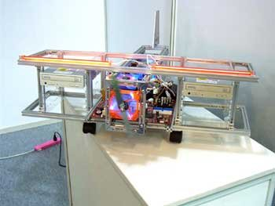

This weekend I visited [CeBIT 2004](http://www.cebit.de/) at Hannover and as usual there was a lot to see. It was a trip of about 450 KM but we had no traffic problems, although there were a lot of road works. We slept in the hotel [Montana Lauenau](http://www.montana-hotels.de/site/hotel/hotelindex.php?hotelid=2) which was perfectly in order and was on the road to Hannover. Finding parking at CeBIT was far from easy, practically all parkings where full but we did find one for only 5 euro for the whole day!

One of the things I have seen a lot at CeBIT were usb-sticks (one seen of 1GB) and mp3 players in all kinds of formats and capacity. An original idea was [Lubic](http://www.aerocool.com.tw/aerocool-files-v3/lubic/gallery.htm) where you can create your own PC case with components, like you do with Lego. It goes from an Airplane to a Giraffe, for example:

SOHOTANK Stackable External Box from the company [Stardom](http://www.stardom.com.tw/main_e.htm) was exacly what I was searching for. It has a very nice design and it's easily expandable. They offer also RAID solutions!
