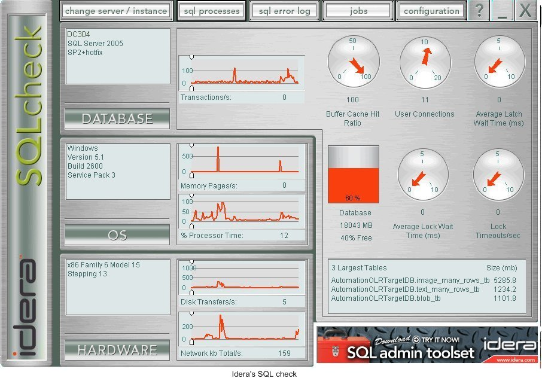

[Idera's SQLcheck](http://www.idera.com/Products/SQLcheck/) quickly investigates, organizes and explains critical information about your server’s hardware, operating system and SQL Server. With SQLcheck's performance dashboard, you can quickly view detailed explanations and receive recovery suggestions. Get the information you need to efficiently manage your SQL Server environment.

Best of all it's FREE and it can be used as a screensaver!
