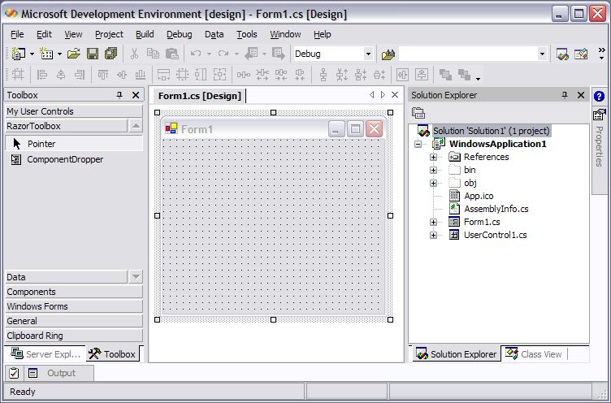
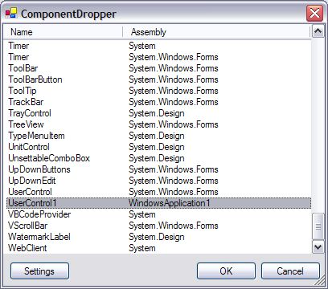
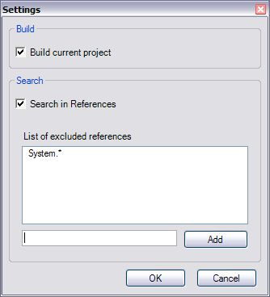

**RazorToolbox** is a set of utilities/tools in the form of addins, macros, components, etc. for Visual Studio.NET. In the initial release of RazorToolbox we have **ComponentDropper**.

In .NET you can easily build components (= also controls), but in order to use them on your designer surface you have to add them in the toolbox of Visual Studio.NET. But there are some problems. For example if you are writing an exe-application and added some components in the exe-project, you cannot add them to the toolbox, because the toolbox only accepts DLLs. Another issue is when you are developing a set of components in a control library, you will have to refresh the toolbox for each component you added in the library, it is not automatically refreshed and is time-consuming. Besides that there are some controls in .NET that are not displayed in the toolbox, for example the _PropertyGrid_.

ComponentDropper allows you to drop a component on the designer surface from a set of assemblies. For example if you are writing an exe-application and added a usercontrol named _UserControl1_ like the screennshot below:

Take the ComponentDropper from the toolbox and drag it over the form where you want to drop `UserControl1`. You get something like:

This list gives the set of components that reside in the current project and the assemblies that are referenced in the project. There you can double-click on `UserControl1` and it's added to the form.

There are some settings, like you can first build the project before ComponentDropper search for components in the current project. Also you can indicate that ComponentDropper searches in the list of references in the current project. A list of references can be excluded through expressions, for example: `System.\*_`.

Download: [RazorToolbox.zip](http://christophdebaene.com/blog/wp-content/uploads/2004/05/RazorToolbox.zip)

Any feedback and comments are greatly appreciated!
