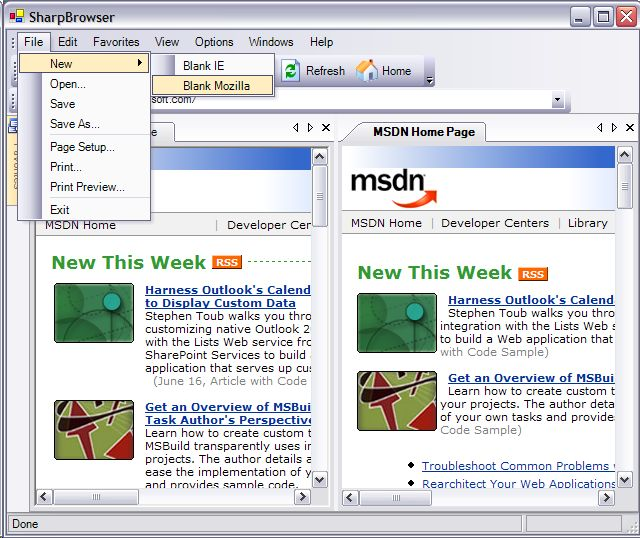

The last couple of weeks I concentrated on writing SharpBrowser. It was already subscribed for a long time on Sourceforge.net, but now I finally released an initial version :-).

The main features of the initial version, is that it is tab-based and it can be used with IE or [Mozilla](http://www.mozilla.org/)! SharpBrowser uses the great UI library from [divil.co.uk](http://www.divil.co.uk/net/) for the menus, toolbars, docking and documents. One of the features is that you for example can choose the UI rendering, e.g.: Office2003, Everett and Whidbey.

In order to use Mozilla you just have to download the [Mozilla 1.7 ActiveX Control](http://www.iol.ie/~locka/mozilla/MozillaControl17t1.exe) and install it. If the installation is successful you will see an extra menuitem, where you can choose the browser: (left is IE, right is Mozilla)

Note that this is an initial release, and that there a bunch of features that must be implemented. In the following weeks I will concentrate on implementing features that are included in the standard IE and after that extra features like:

- cookie mamagement
- download management
- popup killer
- google toolbar
- view partial source
- event viewer
- manage broken links
- mouse gestures
- plugin-mechanism
- etc.

That's why I started writing SharpBrowser, because I am convinced that you can implement a set of very usefull features for a browser that are not (yet) included in IE. I am also thinking about features for web developers, like a viewstate decoder, better support for debugging javascript, test scenarios, etc.

This project give me also the opportunity to experiment with libraries like MyXaml, log4net, Microsoft Application Blocks, etc. For me it is important that I can learn of it, and that the project uses the right concepts, design patterns, libraries, etc. That's the reason why I distribute it in open-source so that we can share our knowledge!

In the next couple of days I will explain some concepts that I implemented for SharpBrowser. Patterns like the visitor, command, composite, facade, etc.

If you have any suggestions, ideas for new features, or want to share about good practices, design patterns, libraries, please let me know!

[SharpBrowser v0.5](http://christophdebaene.com/blog/wp-content/uploads/2004/06/SharpBrowser05.zip)