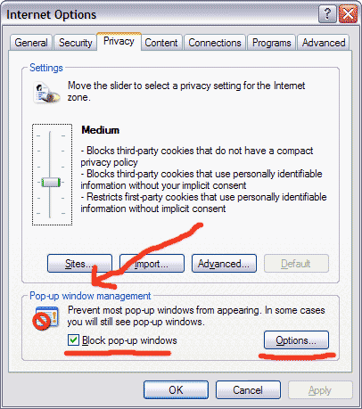

I've seen on MSDN that the WebBrowser control has a new event in SP2, named [NewWindow3](http://msdn.microsoft.com/library/default.asp?url=/workshop/browser/webbrowser/reference/events/newwindow3.asp) . It's an extension to the NewWindow2 event with additional info in the eventargs. The url that initiates the new window, and the url where the new window is redirecting to.

I am pretty sure that this has something to do with the new popup blocker that will be added in Windows XP SP2.

