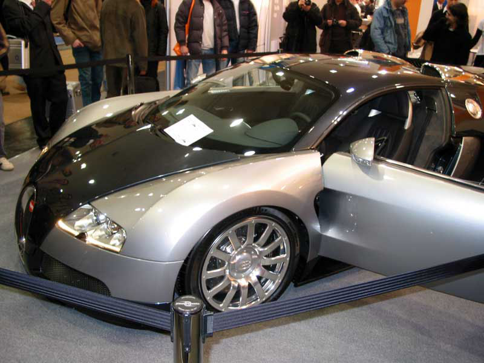
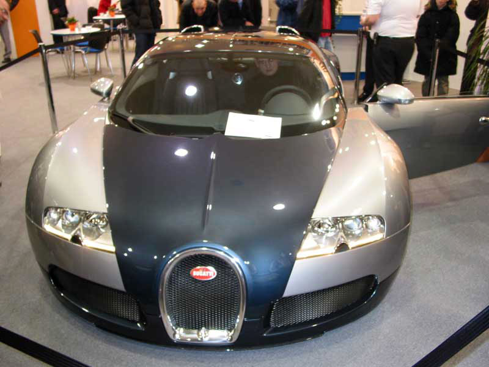
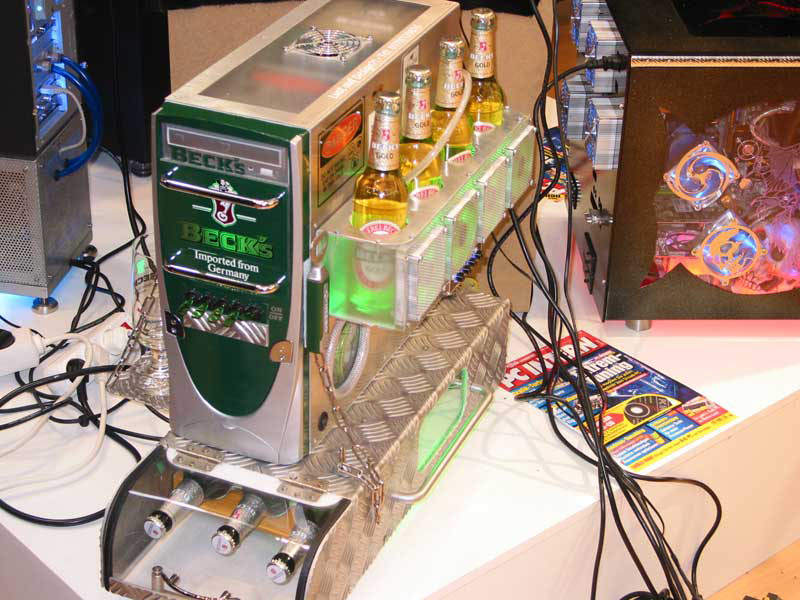
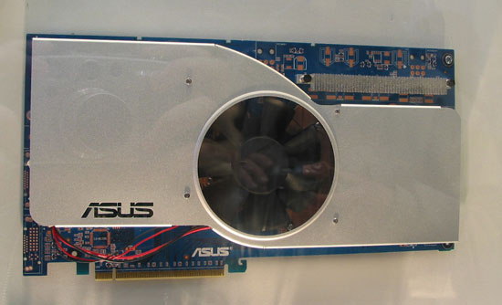
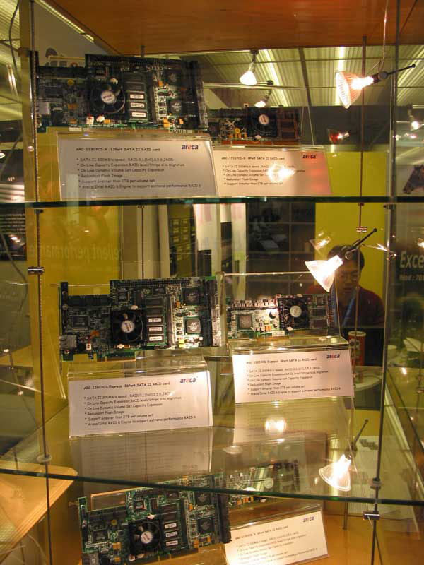

This weekend I visited [CeBIT](https://www.cebit.de). It was a long trip due to road works and heavy rain, but it was worthwhile. There was a lot of people, but thankfully CeBIT at the Messegeländer in Hannover has about 30 halls. In one of the first halls, there was an exclusive car from Bugatti. Surprisingly there was no pricing indicated :-)

I think it was at the expo from AOpen that a couple of case-mods were shown. One of the most original one was certainly this one:

One of the manufactors that i didn't want to miss was [Asus](https://www.asus.com). For me there were 2 things that caught my attention: the new A8N SLI Premium which is the succesor of the [A8N SLI Deluxe](http://usa.asus.com/products/mb/socket939/a8nsli-d/overview.htm) and of course a DUAL Geforce 6800 Ultra on one board. As you can see the board is huge and I don't think it will fit on every motherboard and/or case, but it's still a prototype of course.

One of the things I focused on, was SATA PCI-Express RAID cards because I am planning to buy one for my system. The most well known RAID card in this category at this very moment is [Areca](http://www.areca.com.tw/), who were present too. The card that I am planning to buy is the [ARC-1220](http://www.areca.com.tw/products/html/pciE-sata.htm) with 8x SATA ports.

[HighPoint](http://www.highpoint-tech.com/) showed also their latest products and in particular the RocketRaid 2320, which is an 8 channels PCI-Express to SATA II host adapter. The new products are included in the product guide that I took from the stand at CeBIT. The products they showed are listed [here](http://www.highpoint-tech.com/booth.htm).

I also went to [3Ware](http://www.3ware.com/), and they told to me that the PCI-Express RAID cards will be released by November of this year.

It was a long weekend, and I spent most of the time in the car but it was fun and interesting. See you at CeBIT 2006 :-)
