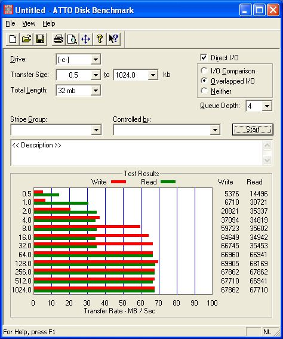
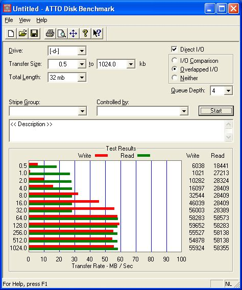
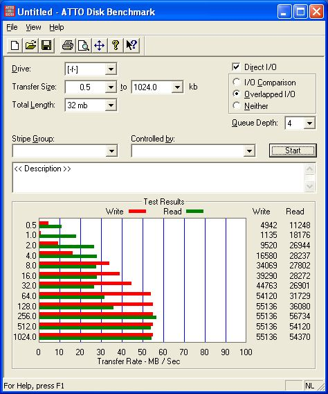
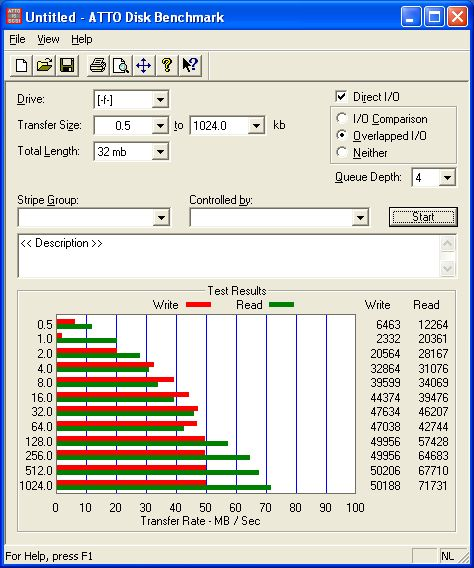
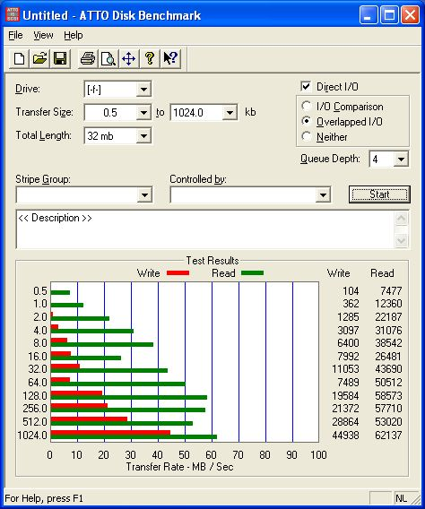
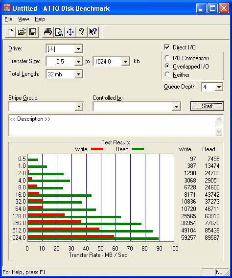

Recently I purchased a new computer and I wanted to setup a RAID5 on 4x SATA Western Digital 200GB's. The motherboard is from Asus, the [A8N SLI Deluxe](http://usa.asus.com/prog/spec.asp?m=A8N-SLI%20Deluxe&langs=09) which has 2 SATA controllers, the Silicon Image 3114R and NForce4. I also purchased a WD Raptor as boot disk which is connected to the NVRaid because it supports NCQ and the SI3114R not.

First of all I wanted to test if my raptor was faster than a normal 7200 rpm HD. And thankfully this was the case, it was about 10MB/s faster.

RAPTOR 74GB 

7200RPM 200GB 

After that I tested some RAID (0, 1, 10) configurations on the SI3114 controller. One thing was clear, that mirroring on the SI3114 isn't optimized for reading, it's even a little bit slower than reading from a single disk. This has also been confirmed in a [review](http://www.xbitlabs.com/articles/storage/print/sil-3114.html) (images are broken) from [xbitlabs](https://www.xbitlabs.com/), where they also conclude that it doesn't have any optimizations for mirrored arrays, but focuses on RAID0. As you can see from the benchmarks there is no performance gain in RAID 1 (left below image) against a single disk (right up image), and RAID10 performs like a RAID0.

RAID 1 STRIPE 64 

RAID 10 STRIPE 64 

So, the SI3114 was not an option for me. Then I looked for setting up a software raid in Windows XP. Yes indeed, you can build a RAID 5 in Windows XP after doing a little hack :-). For more information check out the article at [tomshardware](http://www.tomshardware.com/) named [Using WindowsXP to Make RAID 5 Happen](http://www.tomshardware.com/storage/20041119/).

Here I did a benchmark with a stripe size of 0.5 (default) and 64K. As you can see this gives a big difference.

RAID 5 STRIPE 0.5 

RAID 5 STRIPE 64 

From the benchmarks with default stripe size I conclude that the read performance of RAID5 is about the same compared to a single disk, but the write performance is about the half of a single disk. This solution did not satisfy for me, because the performance is not what I expected, consumes CPU and I don't like the idea that I had to enable it by hacking some DLLs in Windows and there were some issues with Service Pack 2.

Therefore I concluded to buy a PCI-Express SATA Raid controller, namely the [Areca 1220](http://www.areca.com.tw/products/html/pciE-sata.htm). The Areca RAID controllers perform very well and include all the RAID features you need. A very detailed review with a lot of benchmarks can be found [here](http://www.tweakers.net/reviews/536?).

The ASUS A8N SLI Deluxe does have 2x 8xPCI-Express ports, which can be used for example for one VGA card and a RAID card, it doesn't need to be 2 VGA cards. To be sure I sended an email to Asus to ask if the Areca controller is compatible with the motherboard. The Areca stand at CeBIT told me they sended controllers to different manufactors (Asus, MSI, etc.) to test the compatibility and will update the 'Compatibility list' on the [website](http://www.areca.us/).

**UPDATE:** Until now it's not yet possible to combine for example one VGA and one RAID card in an SLI Motherboard, it's a BIOS issue. So, I hope getting more news soon :-)
