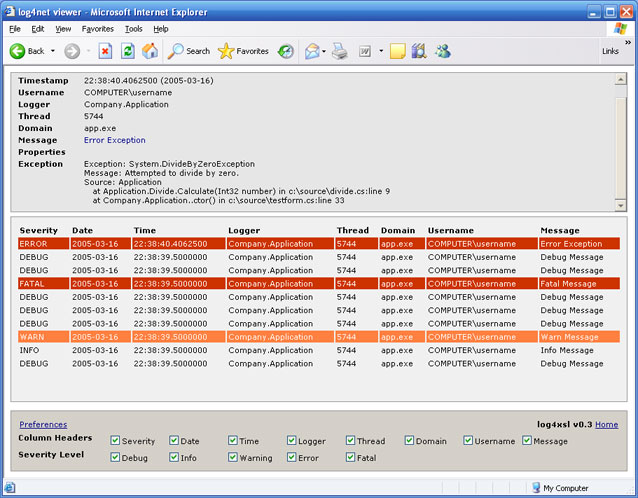
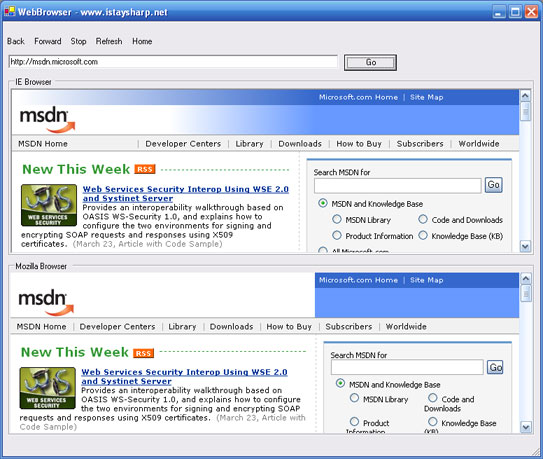

I bought the domain name a couple of months ago but finally the site is online. The purpose of [IStaySharp.NET](http://www.istaysharp.net/) is to provide a resource site for .NET developers (articles, faq, etc.) and to provide information on the projects I am working on.

The two projects currently online is [log4xsl](http://www.istaysharp.net/Projects/log4xsl/index.aspx) which is a xsl for viewing XML files generated by [log4net](http://logging.apache.org/log4net/). Below you find an example of the output:

The [WebBrowser library](http://www.istaysharp.net/Projects/WebBrowser/Index.aspx) is the second project and fully embeds the webbrowser functionality of Internet Explorer and Mozilla. It also provides some extra functionality for Internet Explorer. Below you find a sampe project (top is IE and bottom is Mozilla) that can be downloaded on the site.

There are other projects coming and will be updated to the site. If you have any questions and/or feedback please contact me (contact mail can be found in the About menu).