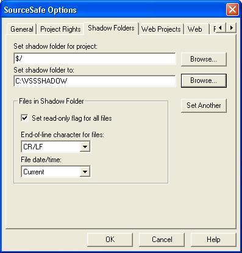

One way of setting up [CC.NET](http://confluence.public.thoughtworks.org/display/CCNET/Welcome%2Bto%2BCruiseControl.NET) and VSS is that CC.NET is responsible for getting the latest version (setting the attribute _autoGetSource_ to _true_ of the _sourcecontrol_ node in the ccnet.config file) or [NAnt](http://nant.sf.net/) by using the _vssget_ task of [NAntContrib](http://nantcontrib.sf.net/) for compiling the sources by NAnt. I always use the [csc](http://nant.sourceforge.net/release/latest/help/tasks/csc.html) task instead of the [solution](http://nant.sourceforge.net/release/latest/help/tasks/solution.html) task, therefore it is necessary to have a clean version of VSS, because VSS does not automatically delete files locally that have been deleted in the VSS database.

An alternative and better way is to set a shadow folder in VSS. A shadow folder contains a copy of the most recently checked-in version of each file in the project. This is exactly what we need for compiling the sources.

That way is CC.NET only using VSS for monitoring changes in the VSS database and/or labeling.
