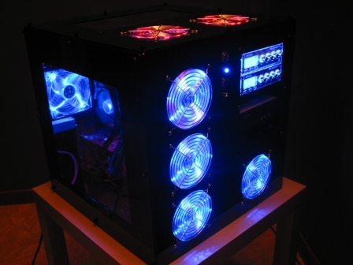

This year I purchased a server for persisting my data and for running applications that require intensive processing. For me it was very important to have a robust & performant way for archiving my data. Therefore I purchased a RAID card from [Areca](http://www.areca.com.tw/), the [ARC-1120](http://www.areca.com.tw/products/html/pcix-sata.htm). The raid card is connected through 8 HD's of 200GB from [Western Digital](https://www.westerndigital.com/) in RAID 5. Areca is currently one of the best RAID cards available. This [page](http://print.tweakers.net/?reviews/536) contains an extended review with benchmarks

My initial idea was to use my current [ASUS A8N-SLI Deluxe](http://www.asus.nl/products/mb/socket939/a8nsli-d/overview.htm) motherboard, which has 2x PCI-E Express ports, and to use one port for the RAID controller. At that time it was still not possible, but now [ASUS](http://www.asus.com/) has provided a new BIOS driver which fixes the [issue](http://60.248.88.210/faq/index.php?action=article&cat_id=001&id=32&lang=en&highlight=A8N%20sli%20deluxe). After a lot of research and certainly the many chats I had with Bruno, I decided to go for a server motherboard. This is simply the most recommended way and is more robust, uses [registered memory](http://en.wikipedia.org/wiki/Registered_memory), has PCI-X ports, dual CPU, more memory slots, etc.

I wanted a server motherboard that contains dual CPU core support and featuring one or two PCI-E ports. This way I can easily upgrade in the future if it is necessary. Therefore I purchased the [Tyan K8WE](http://www.tyan.com/products/html/thunderk8we.html), which is an NForce Pro based server motherboard with 2x PCI Express x16 slots @full speed x16 lanes and has even a firewire connection.

A lot of hardware components means a large case. Therefore I decided to buy the [U2-UFO](https://mountainmods.com/product_info.php?cPath=21_32&products_id=77) case from [Mountainmods](https://www.mountainmods.com/). It's really a case with a lot of space and most important it can contain up to 9 HD's and it's compatible with an Extended ATX motherboard.

I am still configuring the server, but I will certainly post some benchmarks and experiences. In the mean time you can find the specs and some pictures of my server.

- [U2-UFO Black Powder Coat - Original Top](https://mountainmods.com/product_info.php?cPath=21_32&products_id=77)
- [Tyan K8WE](http://www.tyan.com/products/html/thunderk8we.html)
- [2 x AMD Opteron 244](http://www.amd.com/us-en/Processors/ProductInformation/0,,30_118_8826_8832,00.html)
- [4 x OCZ 512MB DDRPC-3200 Server Series](http://www.ocztechnology.com/products/memory/tyan_qualified-br_ocz_ddrpc_3200_server_series)
- [OCZ PowerStream 600 watt](http://www.ocztechnology.com/products/power_management/ocz_powerstream_power_supply)
- [Areca 1120 Raid Card](http://www.areca.com.tw/products/html/pcix-sata.htm)
- [8 x Western Digital WD2000JD 150MB/s](http://www.wdc.com/en/products/Products.asp?DriveID=58)
- [1 x Western Digital WD2000JS 300MB/s](http://www.wdc.com/en/products/Products.asp?DriveID=136)
- [Plextor 716A CD-R & DVD±R Recorder](http://www.plextor-europe.com/products/px-716a.asp?choice=PX-716A)
- [2 x Akasa Fan Controller AK-FC-03](http://www.akasa.com.tw/akasa_english/spec_page/control_panels/spec_ak_fc_03.htm)
- [7 x ACE 120 mm Crystal Clear 2 BallBearing Special 4 Leds Blue](http://www.mpl.be/productinfo/technicalsheet.aspx?prd=35767)
- [2 x CoolerMaster Neon LED Fan RED 120x120mm](http://www.coolermaster-europe.com/index.php?LT=english&Language_s=2&url_place=product&p_serial=TLF-S12&other_title=TLF-S12Neon%20LED%20Fan%20120x120mm)

