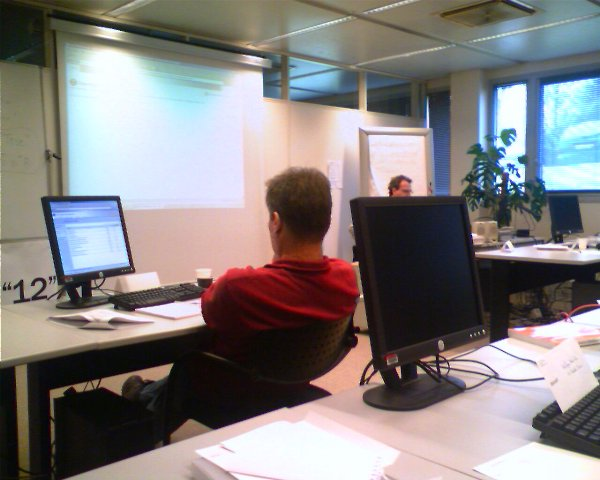
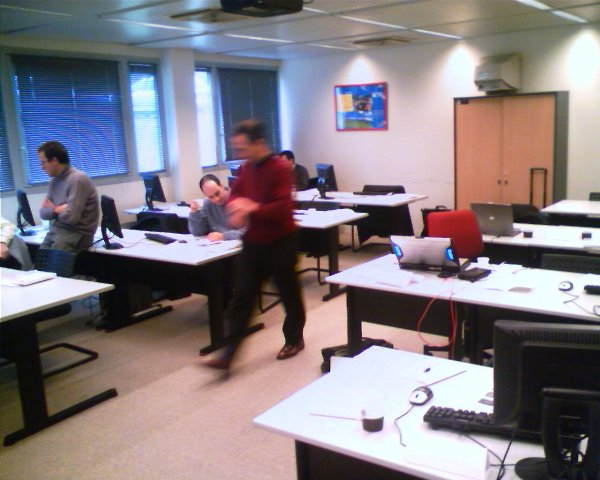

I followed the [Office 12 Ascend training](http://blog.u2u.info/DottextWeb/patrick/archive/2005/12/16/12366.aspx) in Paris that was teached by [Patrick](http://blog.u2u.info/DottextWeb/patrick/). The training was very successful and Patrick showed a lot of interesting stuff and demo's about Office and Sharepoint. So little time, and so much to play with, but thankfully there are the O12 labs which are very useful and detailed.

On Patrick's blog you [find](http://blog.u2u.info/DottextWeb/patrick/archive/2006/01/29/13667.aspx) a group photo with the team of Paris. Here are some pictures I took during the ascend training.

- 
- 
- 
- 

