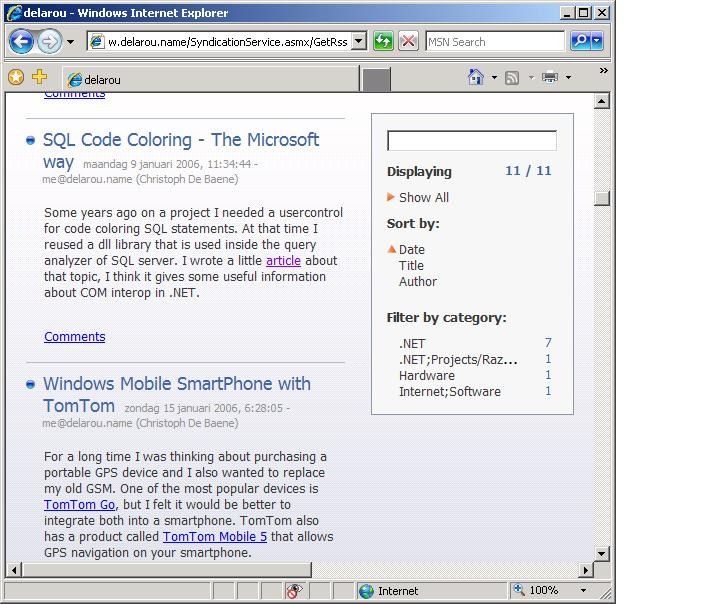

Internet Explorer 7 Beta 2 has been released to the public, and can be downloaded [here](http://www.microsoft.com/windows/ie/ie7/default.mspx). I installed IE7 on a clean WinXP SP2 without any problems through VPC. My [blog](http://www.christophdebaene.com/blog) site and [IStaySharp.NET](http://www.istaysharp.net) rendered correctly with IE7.

The coolest feature I found, is the integrated rss reader...

