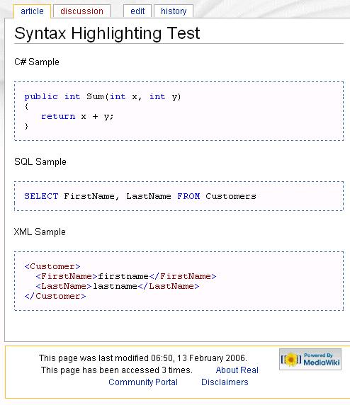

Here I describe how you can add syntax highlighting (C#, SQL, Javascript, etc.) in [MediaWiki](http://www.mediawiki.org/). In MediaWiki you can add syntax highlighting through [GeSHiHighlight](http://meta.wikimedia.org/wiki/GeSHiHighlight) but I found it interesting for combining the world of [PHP](http://www.php.net/) and .NET. For syntax highlighting in .NET I used the [CodeHighlighter ASP.NET Control](http://www.actiprosoftware.com/Products/DotNet/CodeHighlighter/Default.aspx) from [Actipro Software](http://www.actiprosoftware.com/Products/DotNet/Default.aspx).

The intersection between PHP and .NET for communication are [web services](http://en.wikipedia.org/wiki/Web_services). Therefore I created a .NET webservice that provides the method `Parse` with the parameters `code` and `languagekey` (= C#, SQL, XMl, etc.) which returns a HTML string.

```csharp
using System; 
using System.Web; 
using System.Web.Services; 
using System.Text; 
using System.Web.Services.Protocols; 
using System.Configuration; 
using ActiproSoftware.CodeHighlighter; 
using ActiproSoftware.SyntaxEditor;

[WebService(Namespace = "http://tempuri.org/SyntaxHighlighting")] 
[WebServiceBinding(ConformsTo = WsiProfiles.BasicProfile1_1)] 
public class SyntaxHighlighting : System.Web.Services.WebService { 
  
  [WebMethod] 
  public string Parse(string code, string languageKey) 
  { 
      if (string.IsNullOrEmpty(code)) 
        return string.Empty;

      SyntaxLanguage language = GetSyntaxLanguage(languageKey); 
      if (language == null) 
        throw new ApplicationException("LANGKEYNOTEXIST");

      CodeHighlighterEngine engine = new CodeHighlighterEngine(); 
      engine.OutliningEnabled = false; 
      return engine.GenerateHtmlInline(string.Empty, code, language); 
  }

  CodeHighlighterConfiguration GetCodeHighlighterConfig() 
  { 
      CodeHighlighterConfiguration config = (CodeHighlighterConfiguration)HttpContext.Current.Cache["CodeHighlighterConfig"];
      if (config == null) 
      { 
          config = (CodeHighlighterConfiguration)ConfigurationManager.GetSection("codeHighlighter"); 
          HttpContext.Current.Cache.Insert("CodeHighlighterConfig", config); 
      }

      return config; 
  }

  SyntaxLanguage GetSyntaxLanguage(string languageKey) 
  { 
      if (string.IsNullOrEmpty(languageKey)) 
        return null;

      CodeHighlighterConfiguration config = GetCodeHighlighterConfig(); 
      foreach (string key in config.LanguageConfigs.Keys) 
        if (key.ToLower() == languageKey.ToLower()) 
          return CodeHighlighter.GetLanguage(config, key);

      return null; 
  } 
} 
```

In MediaWiki you can extend [WikiText](http://en.wikipedia.org/wiki/Wikitext) so that for example your xml tag is recognized by the parser. This way you can extend the HTML output. In this example you would write in WikiText the following statements:

```xml
<code language="C#"> 
  public int x = 5; 
</code> 
```

In the extensions folder of MediaWiki you add a file called `CodeHighlighting.php` with the following content:

```php
<?php

$wgExtensionFunctions[] = "wfCodeHighlightingExtension";

function wfCodeHighlightingExtension() 
{ 
  global $wgParser; 
  $wgParser->setHook('code', 'renderCode'); 
}

function renderCode($input="", $argv=array()) 
{ 
  $result = SyntaxHighlighting($input, $argv['language']); 
  return ' <pre>' . trim($result) . '</pre> '; 
}

function SyntaxHighlighting($code, $languageKey) 
{ 
  $location = 'http://localhost/SyntaxHighlightingWS/SyntaxHighlighting.asmx?wsdl'; 
  $result = $code;

  try 
  { 
    $client = new SoapClient($location); 
    $arr = array("code" => $code, "languageKey" => $languageKey); 
    $result = $client->Parse($arr)->ParseResult; 
  } 
  catch(SoapFault $exception) 
  { 
    if (strpos($exception->faultstring, "LANGKEYNOTEXIST") === false) 
    { 
      throw $exception; 
    } 
  } 
  
  return $result; 
} 
?> 
```
Through the `setHook` method you can extend WikiText. Here the method `renderCode` is called when a XML element named 'code' is inside your WikiText. Calling a web service in PHP 5 is easy with the [SoapClient](http://php.belnet.be/manual/en/function.soap-soapclient-construct.php) object. If the language we pass does not exist, we simply return the original string.

One more thing must be done, is to add an include in the `LocalSettings.php` in your MediaWiki folder.

```php
include("extensions/CodeHighlighting.php");
```

Finally: 


