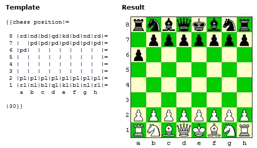
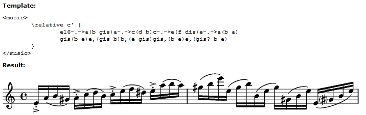

One of the most popular [markup languages](http://en.wikipedia.org/wiki/Markup_language) is HTML. A markup language contains text and meta data about the text, such as layouts, styles, etc. Now [Wiki](http://en.wikipedia.org/wiki/Wiki) sites are becoming more and more popular, and most of them use a customized markup language for HTML. One of the popular wiki sites is [Wikipedia](http://en.wikipedia.org/wiki/Main_Page) and is based on [MediaWiki](http://www.mediawiki.org/wiki/MediaWiki) which uses [WikiText](http://en.wikipedia.org/wiki/Wikitext) as a markup language.

[Here](http://meta.wikimedia.org/wiki/Help:Contents#For_editors) you find the syntax of WikiText. For example an asterix (\*) is used for generating [lists](http://meta.wikimedia.org/wiki/Help:List), the equal sign (=) can be used for [sections](http://meta.wikimedia.org/wiki/Help:Section), and there are many other constructions possible. For example [templates](http://meta.wikimedia.org/wiki/Help:Template) are also possible, then contructions such as this can be made:

There is also an extension called [Wikitex](http://wikisophia.org/wiki/Wikitex) for WikiText which is based on [LaTeX](http://www.latex-project.org/). Where is the time that I wrote my thesis with pdfLaTeX using the [MiKTeX](http://www.miktex.org/) distribution and [WinEdt](http://www.winedt.com/) as my editor, very powerfull tool! However, with WikiTex you can even describe your music notes:

One of the things I really like and I will certainly incorporate with MediaWiki is [UMLGraph](http://www.spinellis.gr/sw/umlgraph/). With this library you can also describe your uml and a picture is generated for you. Examples can be found [here](http://www.spinellis.gr/sw/umlgraph/doc/index.html).

In my opinion, it becomes more important to have markup languages for the web (generates html, images, javascript, etc.). The big advantage is the flexibility of adding and updating the content very easily, without the need of extra tools and/or uploading images. Certainly when you have a wiki based site, where everybody can change the content.

On every site, whether through [MediaWiki](http://www.mediawiki.org/wiki/MediaWiki), [Sharepoint](http://msdn.microsoft.com/office/understanding/sharepoint/default.aspx), [DotNetNuke](http://www.dotnetnuke.com/) or something else, knowledge has to be shared, and each site has its purpose. For example, a developer site has the need for syntax highlighting, uml diagrams, etc, whereas a mathematical site has the need for writing formulas, plots, etc.

Ithink there is a need for a new library (application block) in the .NET community similar to WikiText. A markup language for the web that can be customized, extended and that can be incorporated in each application. Wouldn't it be great that you could write your blog through **WikiText.NET**? :) I think this can be a good subject for the [contest](http://www.realdn.net/msblog/PermaLink,guid,0ccfbc55-cca1-400e-9421-b471d380d93f.aspx).
