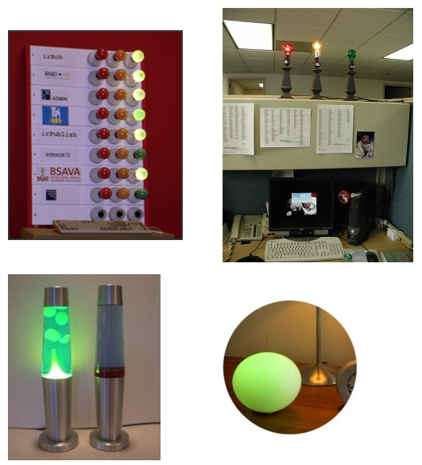

Continuous integration is the process that continuously build, analyze and test your sources. In many cases the process is triggered when changes are notified in the version control system, like [VSS](http://msdn.microsoft.com/vstudio/previous/ssafe/), [CVS](http://en.wikipedia.org/wiki/Concurrent_Versions_System), etc. Martin Fowler has a good article about [continuous integration](http://www.martinfowler.com/articles/continuousIntegration.html).

In the .NET world, the most famous tool is [CruiseControl.NET](http://confluence.public.thoughtworks.org/display/CCNET/Welcome+to+CruiseControl.NET) in combination with [NAnt](http://nant.sourceforge.net/) & [NUnit](http://www.nunit.org/). Getting an e-mail or popup from CruiseControl.NET is nice when a build is broken, but notifying the build status through traffic lights is much cooler.

[Michael Swanson](http://blogs.msdn.com/mswanson/articles/169058.aspx) integrated CC.NET with the [Ambient Orb](http://www.ambientdevices.com/cat/orb/orborder.html). I think that the Ambient Orb is not an option for Europe, but you can integrate by using the [X10](http://en.wikipedia.org/wiki/X10_%28industry_standard%29) home automation technology. A good article about integrating X10 with .NET can be found on [Coding4Fun](http://msdn.microsoft.com/coding4fun/) and is called [Controlling Lights with .NET](http://msdn.microsoft.com/coding4fun/diy/controllights/default.aspx).

Here are some (other) implementations:

- [Build Lights](http://pluralsight.com/blogs/craig/archive/2005/01/24/5386.aspx)
- [Pragmatic Automation](http://www.pragmaticautomation.com/cgi-bin/pragauto.cgi)
- [Continuous Integration with IrBob](http://staff.interesource.com/james/oct05/ci_with_bob.htm)

I am going for a walk this evening, and I think that tomorrow a traffic light will be missing :-D

