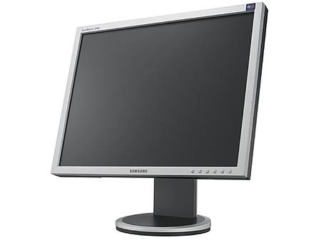

Recently I have a new LCD monitor, the [Samsung 204B](http://www.samsung.com/Products/Monitor/LCD_Digital/LS20BRDBSQXAA.asp). It's a **20.1 inch** LCD monitor, with a resolution of **1600 x 1200** and a response time of **5 ms**.

I am freak when it comes to monitors. I like to have a high resolution and the quality of the screen must be perfect. My current monitor is a [Sony F520](http://www.sony-cp.com/en/products/crt/f_professional/f520/index.html) (CRT), which is very expensive, but it has a resolution of **2048 x 1536@86Hz** and a pitch of **0.22mm**. Therefore I was afraid about the quality of the Samsung 204B compared with my CRT monitor.

In one word, the quality is superb of the Samsung. The colors are vivid and the text is very clear (no ghosting or blur). No dead pixels found, has an ergonomic 4-way adjustable stand and I like the design very much. One more detail, it's about 50 pounds (23 kg) lighter than my current CRT monitor :)

