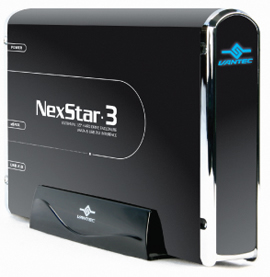

Last week I bought an external harddisk, [Vantec Nexstar 3 (NST-360SU-BK)](http://www.vantecusa.com/product-storage.html), that can be connected through USB 2.0 and [eSata](http://en.wikipedia.org/wiki/SATA). eSata is simply a new standard for connecting external SATA drives at full speed! I use the external harddisk to share data between my laptop (through USB 2.0) and my desktop PC (through eSata). I use extensively Virtual PC for development, and it's a good thing when developing on my desktop PC I can use the full speed of my HD.

