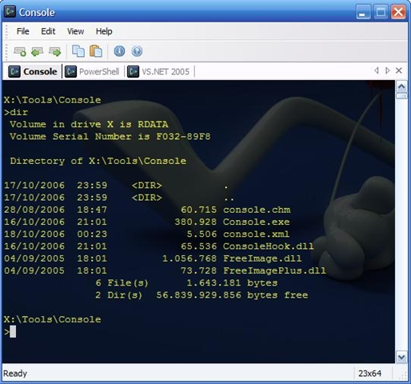

One of the oldest and most basic programs is certainly the command prompt (_cmd.exe_). One thing is certain, you still can't do without the command prompt, and certainly being a developer.  I came across a nice tool, called [Console](http://sourceforge.net/projects/console/), which enhances the command prompt. I have been using it for a couple of months now, and I really like it.

One of the things you should really customize is your PROMPT. More information about changing the PROMPT can be found [here](http://www.hanselman.com/blog/ABetterPROMPTForCMDEXEOrCoolPromptEnvironmentVariablesAndANiceTransparentMultiprompt.aspx). Having, for example, your current directory path on a separate line is really useful. You can customize it through the environment variable called PROMPT, like [Scott](http://www.hanselman.com/blog/ABetterPROMPTForCMDEXEOrCoolPromptEnvironmentVariablesAndANiceTransparentMultiprompt.aspx) is doing, but I prefer passing it as a parameter to the cmd.exe. This way I can easily copy the application and no reboot is required. This can be done by the /k argument of the _cmd.exe_.

Here is a snippet of my XML configuration file for Console.

```xml
<tab title="Console">
    <console shell="cmd /k PROMPT $p$_$+$g" init_dir=""/>
    <cursor style="11" r="255" g="255" b="255"/>
    <background type="2" r="0" g="0" b="0">
        <image file="" relative="0" extend="0" position="0">
            <tint opacity="190" r="0" g="0" b="0"/>
        </image>
    </background>
</tab>
<tab title="cmd">
    <console shell="cmd.exe /k PROMPT $p$_$+$g" init_dir=""/>
    <cursor style="11" r="255" g="255" b="255"/>
    <background type="0" r="0" g="0" b="0">
        <image file="" relative="0" extend="0" position="0">
            <tint opacity="0" r="0" g="0" b="0"/>
        </image>
    </background>
</tab>
<tab title="VS.NET 2005">
    <console shell="cmd /k PROMPT $p$_$+$g &amp;&amp; C:PROGRA~1MID05A~1VCvcvarsall.bat" init_dir=""/>
    <cursor style="0" r="255" g="255" b="255"/>
    <background type="2" r="0" g="0" b="0">
        <image file="" relative="0" extend="0" position="0">
            <tint opacity="188" r="0" g="0" b="0"/>
        </image>
    </background>
</tab>
<tab title="PowerShell">
    <console shell="C:WINDOWSsystem32windowspowershellv1.0powershell.exe" init_dir=""/>
    <cursor style="0" r="255" g="255" b="255"/>
    <background type="2" r="0" g="0" b="0">
        <image file="" relative="0" extend="0" position="0">
            <tint opacity="189" r="0" g="0" b="0"/>
        </image>
    </background>
</tab>
```

This is the result in Console


