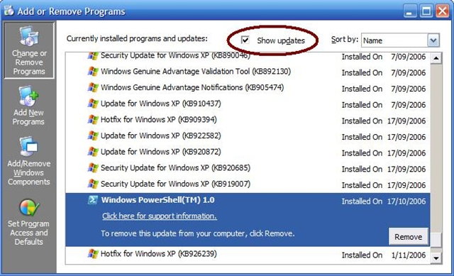

PowerShell 1.0 has been released for Windows XP SP2 and Windows Server 2003. The bits can be downloaded [here](http://www.microsoft.com/technet/scriptcenter/topics/msh/download.mspx). If you already have installed a previous release of PowerShell, you need to uninstall by selecting `Show Updates` in the `Change or Remove Programs`.

