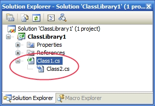

This [macro](http://christophdebaene.com/blog/wp-content/uploads/2006/11/IStaySharp.vsmacros.zip) enables you to nest project items inside Visual Studio .NET. Until now, there is no easy way to nest project items through the Visual Studio IDE, you can only do it by manipulating the project (_.csproj_ or _.vbproj_) file and adding the `DependentUpon` element.

Inside the [IStaySharp.vsmacros](http://christophdebaene.com/blog/wp-content/uploads/2006/11/IStaySharp.vsmacros.zip) file there is a macro called 'Create Dependency' which allows you to nest two selected items. I have even created a [video](http://christophdebaene.com/blog/wp-content/uploads/2006/11/CreateDependency.wmv) to illustrate how to configure and use the macro.
