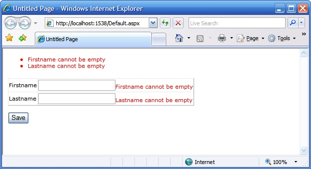

The [Validation Application Block](http://blogs.msdn.com/tomholl/archive/2006/11/27/validation-application-block-revealed.aspx) (VAB) of the upcoming [Enterprise Library v3](http://www.codeplex.com/entlib), uses attributes to describe validations. This gives us for example the opportunity to generate ASP.NET validators based on the attributes decorated on the properties.

Take for example the `NotNullValidator` of VAB, this can be translated to a [RequiredFieldValidator](http://msdn2.microsoft.com/en-us/library/5hbw267h(VS.80).aspx), whereas the `RegexValidator` can be translated to [RegularExpressionValidator](http://msdn2.microsoft.com/en-us/library/eahwtc9e.aspx). You can go further with the `NotNullValidator` and mark required fields with a different backcolor and adding an asterix (\*) to the end of the control.

I am big fan of the [DetailsView](http://msdn2.microsoft.com/en-us/library/system.web.ui.webcontrols.detailsview.aspx) control, you can simply bind a [DataSource](http://msdn2.microsoft.com/en-us/library/system.web.ui.webcontrols.objectdatasource.aspx) control to it, and it will automatically provide you with a caption to each control and two-way binding. Below you find an example how you can extend the [BoundField](http://msdn2.microsoft.com/en-us/library/system.web.ui.webcontrols.boundfield.aspx) control, that investigates the `NotNullValidator` attribute of VAB. Note that I am currently extending it for the other set of validators and in a more OO way. More info will follow later.

```csharp
public class BoundFieldEx : System.Web.UI.WebControls.BoundField
{
    public override void InitializeCell(
        DataControlFieldCell cell, DataControlCellType cellType,
        DataControlRowState rowState, int rowIndex)
    {
        base.InitializeCell(cell, cellType, rowState, rowIndex);
 
        if ((((rowState & DataControlRowState.Edit) != DataControlRowState.Normal) && !this.ReadOnly) ||
             ((rowState & DataControlRowState.Insert) != DataControlRowState.Normal))
        {
            TextBox textBox = null;
 
            if (cell != null && cell.Controls.Count > 0)
                textBox = cell.Controls[0] as TextBox;
 
            if (textBox != null)
            {
                Type dataItemType = null;
 
                if (DataBinder.GetDataItem(base.Control) != null)
                    dataItemType = DataBinder.GetDataItem(base.Control).GetType();
 
                if (dataItemType != null)
                {
                    ValidatorAttribute attribute = IsRequired(dataItemType, base.DataField);
 
                    if (attribute != null)
                    {
                        string textBoxID = this.DataField;
                        textBox.ID = textBoxID;
 
                        RequiredFieldValidator validator = new RequiredFieldValidator();
                        validator.ControlToValidate = textBoxID;
                        validator.ID = string.Concat("RequiredValidatorOf", textBoxID);
                        validator.Display = ValidatorDisplay.Dynamic;
                        validator.ErrorMessage = attribute.MessageTemplate;
                        cell.Controls.Add(validator);
                    }
                }
            }
        }
    }
 
    private ValidatorAttribute IsRequired(Type dataType, string property)
    {
        PropertyInfo propertyInfo = dataType.GetProperty(property);
 
        if (propertyInfo != null)
        {
            foreach (Attribute attribute in propertyInfo.GetCustomAttributes(true))
            {
                if (attribute is NotNullValidatorAttribute)
                    return attribute as ValidatorAttribute;
            }
        }
 
        return null;
    }
}
```


Now you create a custom business object, called Customer, and bind it to the DetailsView through an ObjectDataSource.

```csharp
public class Customer
{
    private string _firstName;
    private string _lastName;
 
    [NotNullValidator(MessageTemplate="Firstname cannot be empty")]
    public string FirstName
    {
        get { return _firstName; }
        set { _firstName = value; }
    }
 
    [NotNullValidator(MessageTemplate="Lastname cannot be empty")]
    public string LastName
    {
        get { return _lastName; }
        set { _lastName = value; }
    }
 
    public Customer Fill()
    {
        Customer customer = new Customer();
        customer.FirstName = "Christoph";
        customer.LastName = "De Baene";
        return customer;
    }
}
```

Inside your aspx page you have something like

```xml
<asp:ObjectDataSource id="customerDataSource" TypeName="IStaySharp.Business.Customer, IStaySharp.Business" DataObjectTypeName="IStaySharp.Business.Customer, IStaySharp.Business" SelectMethod="Fill" runat="server">
</asp:ObjectDataSource>
 
<asp:ValidationSummary runat="server"/>
 
<asp:DetailsView DataSourceID="customerDataSource" DefaultMode="Edit" AutoGenerateRows="false" runat="server">
    <Fields>
        <rfx:BoundField HeaderText="Firstname"  DataField="FirstName"/>
        <rfx:BoundField HeaderText="Lastname"   DataField="LastName"/>
    </Fields>
</asp:DetailsView>
```

Here is the result if you leave the properties empty:

