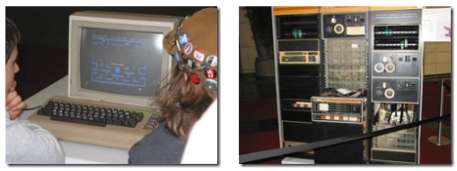

Last weekend I visited [CeBIT](http://www.cebit.de/) 2007 in Hannover. We rented a [house](http://www.ferienwohnung-rintelmann.de/) for the weekend in [Steinhude](http://www.steinhude-am-meer.de/) which is not far from CeBIT and can easily be reached by car and train. If you are looking to stay overnight in Steinhude I would recommend this [house](http://www.ferienwohnung-rintelmann.de/), all comfort is available (TV, shower, kitchen, etc.).

Like every year, there were lots of brands and new products to discover. One of the cool things at CeBIT, is that you can gather a lot of gadgets :). An eyecatcher was this modding project for the [World Cyber Games 2007](http://www.worldcybergames.com/6th/main.asp) which is a 200 hours project! And I found that server rack of IBM also impressive.

One of the things that really touched me - a trip down memory lane -, was a working Commodore 64 of the good old days. There was a room that showed some computer history.

If I remember correctly, I have had the following computers with which I grew up, and I have to admit, it was mainly for playing games :-)

- [Atari 7800](http://www.old-computers.com/museum/computer.asp?c=898&st=2)
- [Sinclair QL (Quantum Leap)](http://www.old-computers.com/museum/computer.asp?c=199&st=1)
- [Commodore 64](http://www.old-computers.com/museum/computer.asp?c=98&st=1)
- [Commodore 128](http://www.old-computers.com/museum/computer.asp?c=96&st=1)
- [Amiga 500](http://www.old-computers.com/museum/computer.asp?c=65&st=1)
- [Amiga 1200](http://www.old-computers.com/museum/computer.asp?c=628&st=1)

And when I came of age, I switched to the traditional personal computer. But I must say that there is really nothing compared to those old skool arcade games, such as

- Commodore
    - [International Karate +](http://en.wikipedia.org/wiki/International_Karate_Plus)
    - [Green Beret](http://homepages.tesco.net/parsonsp/html/green_beret.html)
    - [Commando](http://homepages.tesco.net/parsonsp/html/commando.html)
    - [Ghosts'n Goblins](http://homepages.tesco.net/parsonsp/html/ghosts_n_goblins.html)
    - [Krakout](http://en.wikipedia.org/wiki/Krakout)
    - [Bruce Lee](http://www.lemon64.com/index.php?mainurl=http%3A//www.lemon64.com/reviews/view.php%3Fid%3D550)
    - [Aztec Challenge](http://www.lemon64.com/index.php?mainurl=http%3A//www.lemon64.com/reviews/view.php%3Fid%3D232)
    - [Operation Wolf](http://www.lemon64.com/index.php?mainurl=http%3A//www.lemon64.com/reviews/view.php%3Fid%3D217)
    - etc.
- Amiga
    - [Lotus Esprit Turbo Challenge](http://en.wikipedia.org/wiki/Lotus_(computer_games))
    - [Shufflepuck Cafe](http://www.mobygames.com/game/shufflepuck-cafe)
    - [Battle Squadron](http://en.wikipedia.org/wiki/Battle_Squadron)
    - [Cannon Fodder](http://en.wikipedia.org/wiki/Cannon_Fodder)
    - [Lemmings](http://en.wikipedia.org/wiki/Lemmings_(video_game))
    - [Wings](http://www.lemonamiga.com/?mainurl=http%3A//www.lemonamiga.com/games/details.php%3Fid%3D1133)
    - [Rick Dangerous](http://en.wikipedia.org/wiki/Rick_Dangerous)
    - etc.
