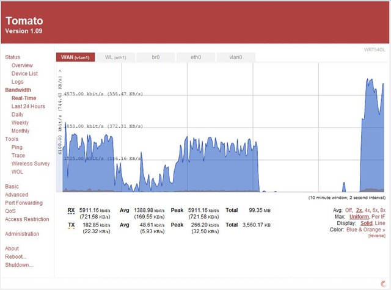

Last week, I purchased a [Linksys WRT54GL](http://www.linksys.com/servlet/Satellite?c=L_Product_C2&childpagename=US%2FLayout&cid=1133202177241&pagename=Linksys%2FCommon%2FVisitorWrapper&lid=7724139789B08) at [RouterShop.nl](http://www.routershop.nl/). The service at Routershop.nl was really fast: at around 1:00pm I created the order and it was delivered the very next day!

The big advantage of [WRT54GL](http://en.wikipedia.org/wiki/WRT54G) is that you can upgrade the firmware of the device. Some popular firmware's are [DD-WRT](http://www.dd-wrt.com/), [OpenWRT](http://openwrt.org/) and [Tomato](http://www.polarcloud.com/tomato). I am using Tomato, of which today a new version has been released, i.e. [Tomato 1.09](http://www.polarcloud.com/f/Tomato_1_09.7z). Tomato has a very nice interface, many interesting features and great-looking graphs. Below you will find a nice graph concerning the bandwidth:

Note that you need to install the [Adobe SVG Viewer](http://www.adobe.com/svg/viewer/install/main.html) in order to view the graphs.
