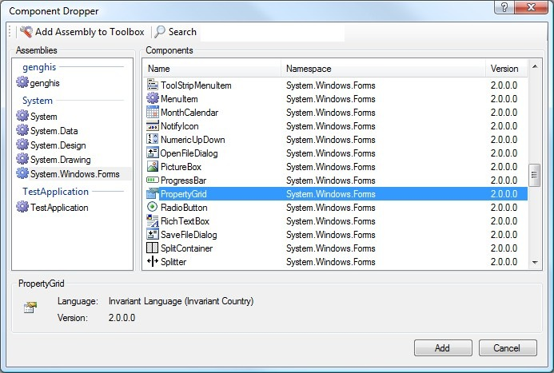

Component Dropper is a component that resides in the toolbox of VS.NET and enables you to choose a component (controls, datasets, providers, components, etc.) from the assemblies that are referenced in the current project.

In Visual Studio .NET you can auto populate the controls in the toolbox by setting the `AutoToolboxPopulate` property to true in menu _Tools -> Options -> Windows Forms Designer_.

Component Dropper is an alternative way for dropping a component on the designer surface. It gives you a dialog with all the components that reside in the assemblies that are referenced in the current project. This means that it is not limited to the assemblies that reside in the current solution. This way you can easily browse and search throughout the assemblies and controls, this is very handy if you have bunch of assemblies and controls. There is never a need to refresh the toolbox, because it dynamically searches throughout the references in the current project.

Download: [RazorToolbox](http://christophdebaene.com/blog/wp-content/uploads/2008/03/RazorToolbox.zip)

If after installation you don't see the component dropper appearing in the toolbox, you can simply drag-and-drop the `IStaySharp.RazorToolbox.dll` to the toolbox.

Any suggestions or remarks are welcome!
