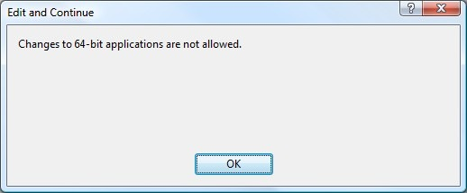
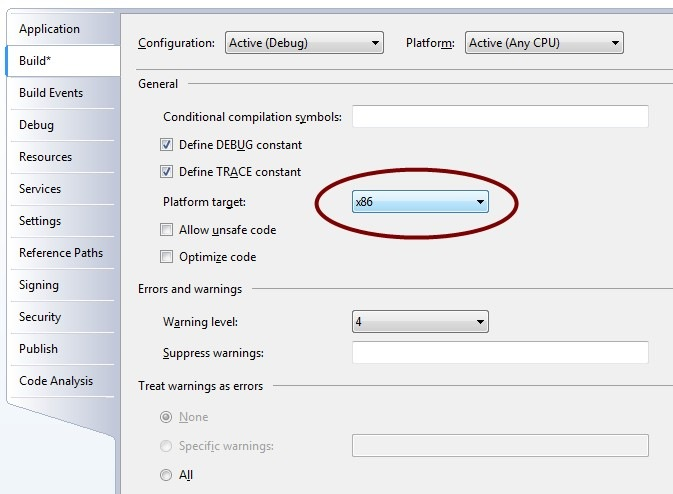

When trying to edit some code during debug, I received the following dialog of Visual Studio:

It appears that the edit and continue feature is not supported when the target is a 64-bit application. On [this](http://msdn2.microsoft.com/en-us/library/ms164927.aspx) page you find a nice overview of the scenarios where the edit and continue features are not supported. To resolve the problem, you have to set the target to x86, which can be found in the project properties.

