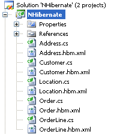

[NHibernate](http://www.hibernate.org/343.html) uses an xml file to describe the mapping. Typically it is embedded as a resource file inside your project and it has a consistent filename convention, namely `.hbm.xml`. Typically an NHibernate project has the following structure



Would it not be nice if we can organize it in the following way? I found it always handy that related classes, like designer classes and resource files are grouped together.


To achieve this structure we can start from the first structure and nest the xml file trough a [macro](http://www.christophdebaene.com/blog/2006/11/21/visual-studio-net-macro-for-nesting-project-items/) that I’ve written.

The second step, is to make clear to NHibernate where the mapping files reside. Note that resources that are nested to a class are compiled differently and thus NHibernate will not recognize the mapping files anymore. Therefore we need to traverse manually the assembly and try each embedded resource file. Below you find the resulting code

```csharp
var domainAssembly = typeof(MyDomain.Order).Assembly;
NHibernate.Cfg.Configuration cfg = new NHibernate.Cfg.Configuration();
 
foreach (var resourceName in domainAssembly.GetManifestResourceNames())
{
   try
   {
      cfg.AddResource(resourceName, domainAssembly);
   }
   catch (NHibernate.MappingException)
   {
      //ignore
   }
}
```
