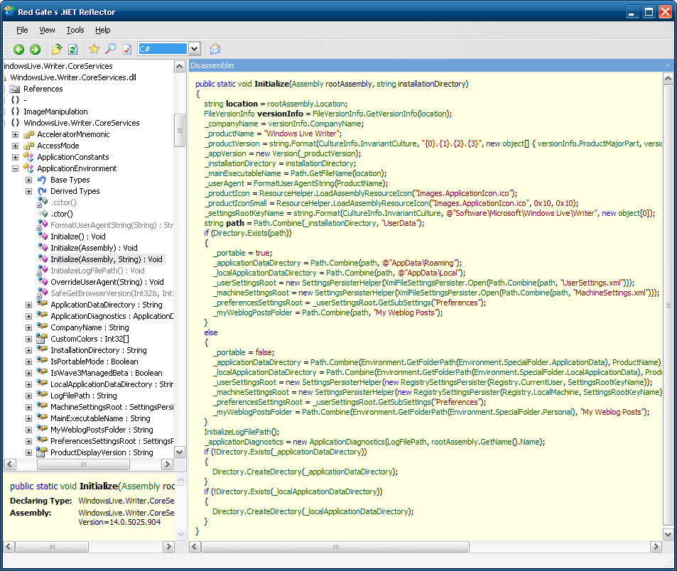
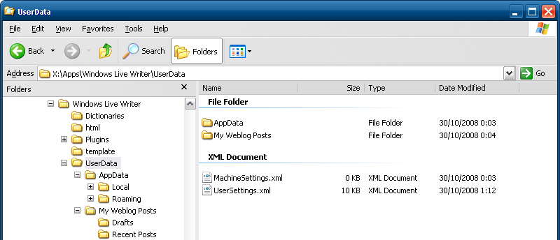

I am using [Windows Live Writer](http://windowslivewriter.spaces.live.com/) for posting items to my [blog](http://www.christophdebaene.com/blog). One thing that I don’t like in general, is that applications store resources in the [MyDocuments](http://en.wikipedia.org/wiki/My_Documents) folder and that you cannot specify another location. I’m a huge fan of [portable applications](http://en.wikipedia.org/wiki/Portable_application), which means that they don’t need any registry settings and/or dependencies, so that you can simply xcopy deploy to another location. Certainly if you are using an [external HD](http://en.wikipedia.org/wiki/External_hard_drive), [USB flash drive](http://en.wikipedia.org/wiki/USB_flash_drive), etc.

Windows Live Writer (WLW) stores by default the drafts in the `MyDocuments\My Weblog Posts\Drafts` folder. I am using the latest [beta](http://windowslivewriter.spaces.live.com/blog/cns!D85741BB5E0BE8AA!1533.entry) (v14.0.5025.904) of WLW and didn’t find any settings through the application that enables you to customize folder paths.

I decided to dig into the assemblies of WLW via reflector to see how it is implemented. After some investigation I found that there is a class called `ApplicationEnvironment` that reside in the _WindowsLive.Writer.CoreServices_ assembly. The `Initialize` method looks like this

Apparently WLW has built-in functionality that enables you to run the application with the settings carried around with the software. WLW checks if there is a folder called ‘UserData’ in the installation folder and uses that folder to store all settings, drafts, etc. This is really great, you simply copy all contents of your WLW directory to for example your external drive and you simply create a folder called `UserData`. If you start WLW again it will create all the necessary subfolders and settings.

I think it’s a feature of WLW beta that has not been documented yet ;-)
