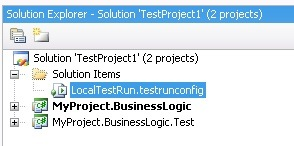
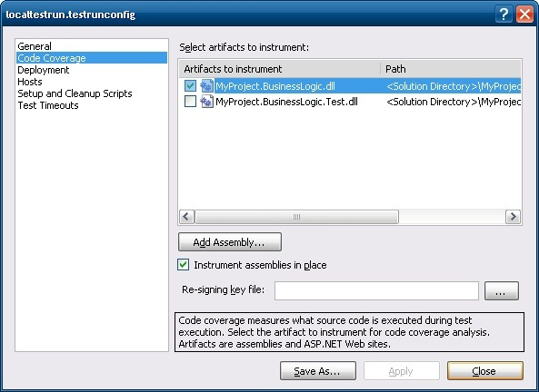
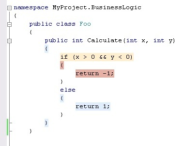

Code coverage is used to determine how effectively your tests exercise the code in your application. This way you can identify sections of code that are covered, not covered or partially covered by your tests.

Visual Studio uses 2 different types of analysis, block-based statement coverage (C1 coverage) and line-based coverage.

- **Block-based statement coverage**

      A block is defined as a sequence of instructions that have a single entry point and a single exit point. Exit points include branch instructions, a function call, a return instruction, or, for managed code, a throw instruction.

- **Line-based coverage**

      For line-based coverage, the tools identify all of the blocks that make up a line and then use this information to determine the level of coverage for the line. If all of the blocks that make up the line are covered, then the tools report that the line is covered. If no blocks in the line are covered, then the tools report that the line is not covered. If some, but not all, of the blocks in the line are covered, then the tools report that the line is partially covered.

Take for example the following class that reside in MyProject.BusinessLogic assembly

```csharp
public class Foo
{
   public int Calculate(int x, int y)
   {
      if (x > 0 && y < 0)
      {
         return -1;
      }
      else
      {
         return 1;
      }
   }
}
```

And a unit test that reside in _MyProject.BusinessLogic.Test_ assembly

```csharp
[TestClass]
public class FooTest
{
   [TestMethod]
   public void Calculate()
   {
      Foo foo = new Foo();
      Assert.AreEqual(1, foo.Calculate(3, 4));
   }
}
```

To enable code coverage you need to double-lick on the LocalTestRun.testrunconfig file that is located in the 'Solution Items' folder.



Inside the 'Code Coverage' tab you select the assembly that you want to instrument. In this case we select _MyProject.BusinessLogic.dll_ assembly.



Now you will need to run your unit tests again. Note that code coverage doesn't work when you debug your unit tests, so you will need to run your unit tests through the menu 'Test –> Run –> All Tests in Solution (CTRL+R, A)'. After that you can view a report about the code coverage results through the menu 'Test –> Windows –> Code Coverage Results'.


From the results we notice that we don't have 100% code coverage because our unit test only reached one part of the condition inside the Calculate method. If you open the Foo class and enable the code coloring you see the parts that are covered, not covered or partially covered.



- **Light Blue:** Indicates that the entire line of code was exercised in the test run.
- **Beige:** Indicates that only a portion of the code blocks within the line of code were exercised in the test run.
- **Reddish Brown:** Indicates that the line was not exercised in the test run.

Code coverage inside Visual Studio uses [statement coverage](http://en.wikipedia.org/wiki/Code_coverage) and in this case the number of IL instructions reached is taken into account. If we add some statements in the Foo class and run again our code coverage we notice that the coverage has been raised form 71,43% to 92,59%. It's important to notice, that when you refactor your class it influences the code coverage even when the contract of the class is the same! This is very different from [Branch coverage](http://en.wikipedia.org/wiki/Code_coverage) where each control structure is evaluated to true and false. In this case we would have 50% code coverage.

```csharp
public class Foo
{
   public int Calculate(int x, int y)
   {
      if (x > 0 && y < 0)
      {
         return -1;
      }
      else
      {
         Console.WriteLine(x.ToString());
         Console.WriteLine(x.ToString());
         Console.WriteLine(x.ToString());
         Console.WriteLine(x.ToString());
         Console.WriteLine(x.ToString());
         Console.WriteLine(x.ToString());
         Console.WriteLine(x.ToString());
         Console.WriteLine(x.ToString());
         Console.WriteLine(x.ToString());
         Console.WriteLine(x.ToString());
 
         return 1;
      }
   }
}
```