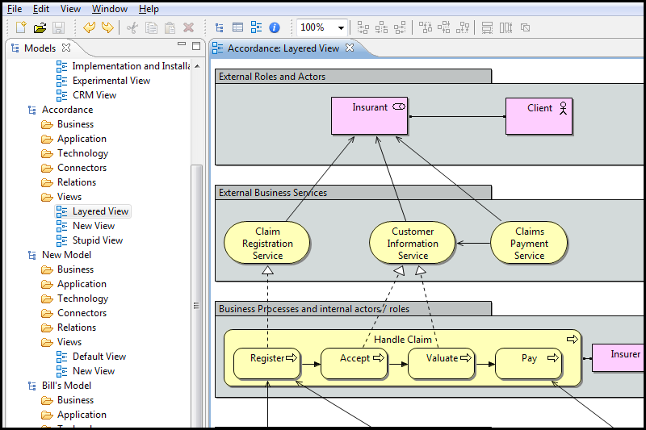

[ArchiMate](http://www.archimate.org/en/home/) is an open and independent Enterprise Architecture modeling language that supports the description, analysis and visualization of architecture within and across business domains. ArchiMate is one of the open standards hosted by [The Open Group](http://www.opengroup.org/) and is based on the IEEE 1471 standard.

The goals of ArchiMate are

- To describe architectures and their **relations**
- **Communicate** enterprise architectures with all stakeholders
- Judge the impact of **changes**
- **Realise** architecture by relating to existing standards, techniques and tools

[Archi](http://archi.cetis.ac.uk/) is a free open source java application to create ArchiMate models.

You can also find a quick reference card of Archimate [here](https://doc.novay.nl/dsweb/Get/Document-52048/) and you can also download [Archimate stencils](https://doc.novay.nl/dsweb/Get/Document-32177/ArchiMate%20Visio%20stencils.zip) for Visio.
