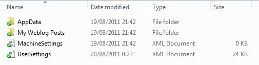
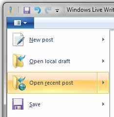
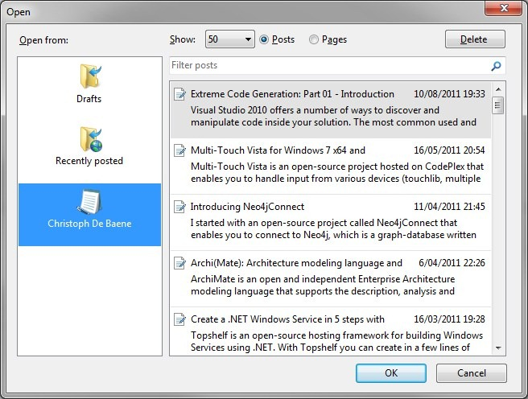

[Windows Live Writer](http://explore.live.com/windows-live-writer) (WLW) is a great tool that enables you to edit and publish your blog posts. Below you find some tips about WLW.

#### Make WLW portable

I love [portable applications](http://en.wikipedia.org/wiki/Portable_application), it enables you to store them on a USB drive or in the cloud without losing your settings and data. It turns out that it’s pretty easy to make WLW portable, and thankfully the [investigation](http://www.christophdebaene.com/blog/2008/10/30/how-to-make-your-windows-live-writer-portable/) I did 3 years ago is still valid for version 2011!

The steps are very simple

1. **Copy** all the contents of your installation folder (`C:\Program Files (x86)\Windows LiveWriter`) to your destination folder (e.g. USB stick)
2. **Create** a **folder** called `UserData` in your destination folder (same level with the folders `Dictionaries`, `Plugins`, …)

You will see after launching WLW and configuring your blog site it will create all necessary files and folders for you settings and posts inside the `UserData` folder!

#### Edit existing posts

With WLW it’s possible to edit existing posts (that originally were not posted with WLW) on your blog. It’s not directly clear from the user interface how to do that!

Click on the app menu in the ribbon bar en click on _**Open recent post**_, not the items that appear on the right!

After that you get a dialog where you can choose your blog site on the right. It retrieves all post items of your blog and you simply pick the one that you want to edit!

#### Use DropBox to sync your local drafts across computers

I use [DropBox](http://www.dropbox.com/) a lot, it’s a free hosting service that enables you to store and share files and folders across the internet. I use it to share my portable utilities and tools, and also WLW (after making it portable). This way I can always access my drafts and edit them when and where I want!