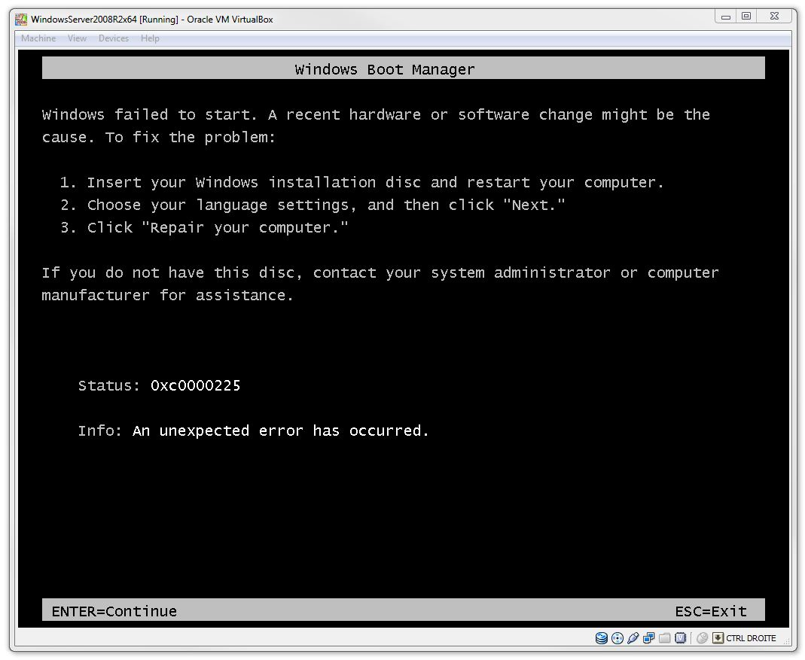
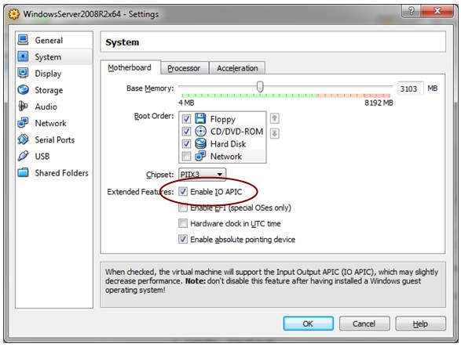

When trying to setup and install Windows Server 2008 R2 x64 on [VirtualBox](https://www.virtualbox.org/) you may encounter the following error

It turns out you need to enable the [IO APIC](http://en.wikipedia.org/wiki/Intel_APIC_Architecture) setting, like below

