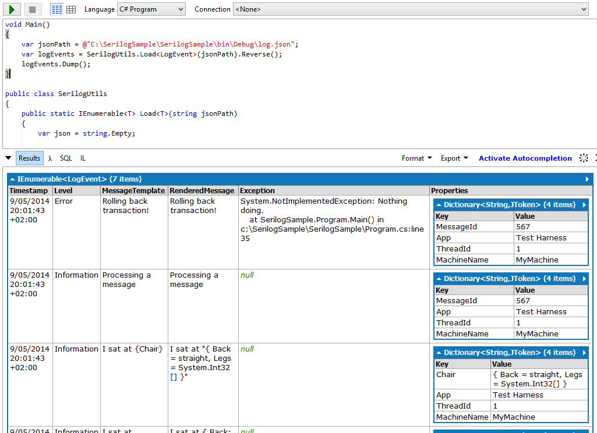

[Serilog](http://serilog.net/) is a logging framework that enables structured logging. More information on how it can be used and configured can be found [here](https://github.com/serilog/serilog/wiki/Getting-Started). Note that for the following snippets you need [Serilog 1.3](http://nblumhardt.com/2014/04/one-year-of-serilog/) or greater.

Take for example the following code snippet (taken from the [sample](https://github.com/serilog/serilog/blob/master/sample/Harness/Program.cs)) where we changed the configuration to write to a [json](http://en.wikipedia.org/wiki/JSON) as well.

```csharp
using Serilog;
using Serilog.Enrichers;
using Serilog.Formatting.Json;
using Serilog.Sinks.IOFile;
using System;
 
namespace Sample
{
    class Program
    {
        static void Main()
        {
            Log.Logger = new LoggerConfiguration()
              .MinimumLevel.Debug()
              .WriteTo.File(@"log.txt")
              .WriteTo.Sink(new FileSink(@"log.json", new JsonFormatter(false, null, true), null))
              .WriteTo.Console()
              .Enrich.WithProperty("App", "Test Harness")
              .Enrich.With(new ThreadIdEnricher(),
                          new MachineNameEnricher())
              .CreateLogger();
      
            Log.Information("Just biting {Fruit} number {Count}", "Apple", 12);
            Log.ForContext<Program>().Information("Just biting {Fruit} number {Count:0000}", "Apple", 12);
      
            Log.Information("I've eaten {Dinner}", new[] { "potatoes", "peas" });
      
            Log.Information("I sat at {@Chair}", new { Back = "straight", Legs = new[] { 1, 2, 3, 4 } });
            Log.Information("I sat at {Chair}", new { Back = "straight", Legs = new[] { 1, 2, 3, 4 } });
      
            var context = Log.Logger.ForContext("MessageId", 567);
            try
            {
              context.Information("Processing a message");
              throw new NotImplementedException("Nothing doing.");
            }
            catch (Exception ex)
            {
              context.Error(ex, "Rolling back transaction!");
            }
      
            Console.ReadKey(true);
        }
    }
}
```

Below is the result of the generated text file (log.txt),

```log4net title="log.txt"
2014-05-09 20:01:43.920 +02:00 [Information] Just biting "Apple" number 12
2014-05-09 20:01:43.937 +02:00 [Information] Just biting "Apple" number 0012
2014-05-09 20:01:43.938 +02:00 [Information] I've eaten ["potatoes", "peas"]
2014-05-09 20:01:43.951 +02:00 [Information] I sat at { Back: "straight", Legs: [1, 2, 3, 4] }
2014-05-09 20:01:43.954 +02:00 [Information] I sat at "{ Back = straight, Legs = System.Int32[] }"
2014-05-09 20:01:43.954 +02:00 [Information] Processing a message
2014-05-09 20:01:43.954 +02:00 [Error] Rolling back transaction!
System.NotImplementedException: Nothing doing.
   at SerilogSample.Program.Main() in c:SerilogSampleSerilogSampleProgram.cs:line 35
```

but it becomes more interesting if we look at the json file (log.json) that has been generated.

```json
{"Timestamp":"2014-05-09T20:01:43.9200064+02:00","Level":"Information","MessageTemplate":"Just biting {Fruit} number {Count}","RenderedMessage":"Just biting "Apple" number 12","Properties":{"Fruit":"Apple","Count":12,"App":"Test Harness","ThreadId":1,"MachineName":"MyMachine"}}
{"Timestamp":"2014-05-09T20:01:43.9370156+02:00","Level":"Information","MessageTemplate":"Just biting {Fruit} number {Count:0000}","RenderedMessage":"Just biting "Apple" number 0012","Properties":{"Fruit":"Apple","Count":12,"SourceContext":"SerilogSample.Program","App":"Test Harness","ThreadId":1,"MachineName":"MyMachine"}}
{"Timestamp":"2014-05-09T20:01:43.9380179+02:00","Level":"Information","MessageTemplate":"I've eaten {Dinner}","RenderedMessage":"I've eaten ["potatoes", "peas"]","Properties":{"Dinner":["potatoes","peas"],"App":"Test Harness","ThreadId":1,"MachineName":"MyMachine"}}
{"Timestamp":"2014-05-09T20:01:43.9510191+02:00","Level":"Information","MessageTemplate":"I sat at {@Chair}","RenderedMessage":"I sat at { Back: "straight", Legs: [1, 2, 3, 4] }","Properties":{"Chair":{"Back":"straight","Legs":[1,2,3,4]},"App":"Test Harness","ThreadId":1,"MachineName":"MyMachine"}}
{"Timestamp":"2014-05-09T20:01:43.9540137+02:00","Level":"Information","MessageTemplate":"I sat at {Chair}","RenderedMessage":"I sat at "{ Back = straight, Legs = System.Int32[] }"","Properties":{"Chair":"{ Back = straight, Legs = System.Int32[] }","App":"Test Harness","ThreadId":1,"MachineName":"MyMachine"}}
{"Timestamp":"2014-05-09T20:01:43.9549787+02:00","Level":"Information","MessageTemplate":"Processing a message","RenderedMessage":"Processing a message","Properties":{"MessageId":567,"App":"Test Harness","ThreadId":1,"MachineName":"MyMachine"}}
{"Timestamp":"2014-05-09T20:01:43.9549787+02:00","Level":"Error","MessageTemplate":"Rolling back transaction!","RenderedMessage":"Rolling back transaction!","Exception":"System.NotImplementedException: Nothing doing.rn   at SerilogSample.Program.Main() in c:\SerilogSample\SerilogSample\Program.cs:line 35","Properties":{"MessageId":567,"App":"Test Harness","ThreadId":1,"MachineName":"MyMachine"}}
```

Each log event is persisted as a json object and separated by a newline. If we look more closely to one of the events you see that we have a _Properties_ collection that contains the [Enrich](https://github.com/serilog/serilog/wiki/Enrichment) values and the values passed through the property values collection.

```json
{
  "Timestamp": "2014-05-09T20:01:43.9510191+02:00",
  "Level": "Information",
  "MessageTemplate": "I sat at {@Chair}",
  "RenderedMessage": "I sat at { Back: "straight", Legs: [1, 2, 3, 4] }",
  "Properties": {
    "Chair": {
      "Back": "straight",
      "Legs": [
        1,
        2,
        3,
        4
      ]
    },
    "ThreadId": 1,
    "MachineName": "MyMachine"
  }
}
```

With [Json.NET](http://www.nuget.org/packages/Newtonsoft.Json/) we can deserialize the log file so that we can use [LINQ](http://msdn.microsoft.com/en-us/library/bb397926.aspx) to query our log events. We have [LogEventLevel](https://github.com/serilog/serilog/blob/master/src/Serilog/Events/LogEventLevel.cs) and LogEvent that represent our log item.

```csharp
public enum LogEventLevel
{
    Verbose,
    Debug,
    Information,
    Warning,
    Error,
    Fatal
}
 
public class LogEvent
{
    public DateTimeOffset Timestamp { get; set; }
    public LogEventLevel Level { get; set; }
    public string MessageTemplate { get; set; }
    public string RenderedMessage { get; set; }
    public string Exception { get; set; }
    public Dictionary<string, JToken> Properties { get; set; }
}
```

Note that the generated json file is not valid and that we need to separate each log event with a comma and make an array of it. Below you have a util class that will do all the plumbing and note that we are using [FileStream](http://msdn.microsoft.com/en-us/library/system.io.filestream.aspx) so that it can also be read even when the file is in use.

```csharp
public class SerilogUtils
{
    public static IEnumerable Load(string jsonPath)
    {
        var json = string.Empty;
 
        using (var fs = new FileStream(jsonPath, FileMode.Open, FileAccess.Read, FileShare.ReadWrite))
        using (var sr = new StreamReader(fs, Encoding.Default))
        {
            json = sr.ReadToEnd();
        }
 
        if (string.IsNullOrEmpty(json))
            return Enumerable.Empty();
 
        json = json.Replace(Environment.NewLine, ",");
        json = "[" + json + "]";
 
        var logEvents = JsonConvert.DeserializeObject<List>(json);
        return logEvents;
    }
}
```

[LINQPad](http://www.linqpad.net/) is a great tool to play with LINQ queries. Just make a reference to [Json.NET](http://www.nuget.org/packages/Newtonsoft.Json/) and use the following using statements inside LINQPAD and after that you can do all sort of reports about you're log events.

- Newtonsoft.Json
- Newtonsoft.Json.Linq
- System.Linq

[](http://christophdebaene.files.wordpress.com/2014/05/seriloglinqpad.png)

Below are some query examples

```csharp
logEvents = logEvents.Where(x => x.Level == LogEventLevel.Information);
logEvents = logEvents.Where(x => (int)x.Properties["ThreadId"] == 1);
logEvents = logEvents.Where(x => !string.IsNullOrEmpty(x.Exception));
 
var result = logEvents
    .Where(x => x.Properties.ContainsKey("MessageId"))
    .GroupBy(x => (int)x.Properties["MessageId"]);
```

In the next blog post we will go a little further and see how we can customize the layout and use json path expressions.
