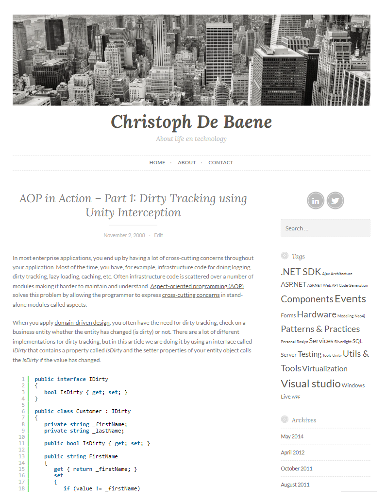

After a decade-long hiatus, I've made the decision to revive my **blog** about my passion for technology and to share my experiences. Moreover, this site serves as my personal **wiki**, a digital repository where I document the tools and insights integral to my daily life as a technical consultant."

<!-- more -->

I began blogging in 2004 and utilized [DasBlog](https://learn.microsoft.com/en-us/previous-versions/aa480016(v=msdn.10)) at that time. I created my own theme called `Business` which gained popularity in the [blogosphere](https://en.wikipedia.org/wiki/Blogosphere) and contributed to a multi-user setup — [DasBlog 1.9 released](https://christophdebaene.be/blog2004/dasblog-19-released/).

{: .center}

For a long time, I used [DasBlog](https://learn.microsoft.com/en-us/previous-versions/aa480016(v=msdn.10)) but eventually I switched to [Wordpress](https://wordpress.com/)

{: .center}

I decided to make a fresh start because much of the content from that time has become obsolete. I opted to use [MkDocs](https://squidfunk.github.io/mkdocs-material/) to create a beautiful documentation site.

I also converted my old blog site to [MkDocs](https://squidfunk.github.io/mkdocs-material/) which is accessible [here](https://christophdebaene.be/blog2004). To facilitate the transformation, I used [wordpress-export-to-markdown](https://github.com/lonekorean/wordpress-export-to-markdown) to have an initial head start and made some adaptations afterward.