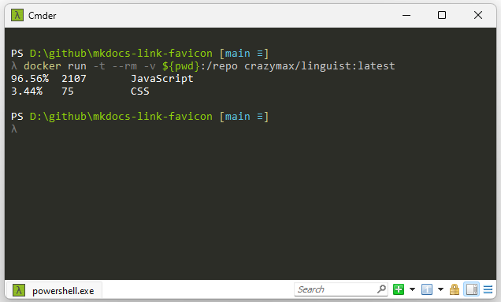

I recently encountered an issue with my GitHub repository, [mkdocs-link-favicon](https://www.github.com/christophdebaene/mkdocs-link-favicon), where the language bar was not being generated. After some investigation, I discovered that GitHub uses a library called [Linguist](https://github.com/github-linguist/linguist) to create language breakdown graphs, and these graphs are recalculated every time changes are pushed to a repository. You can find more details on this process [here](https://github.com/github-linguist/linguist/blob/master/docs/how-linguist-works.md#how-linguist-works-on-githubcom).

<!-- more -->

The source code for my project is located in the `docs` folder, and unfortunately, this folder is [excluded](https://github.com/github-linguist/linguist/blob/master/lib/linguist/documentation.yml) from the Linguist analysis.


To address this issue, you can override the Linguist settings by adding a `.gitattributes` file to your repository. More information about the possible customizations can be found [here](https://github.com/github-linguist/linguist/blob/master/docs/overrides.md).


```gitattributes title=".gitattributes"
docs/** -linguist-documentation
```

!!! warning

    Note the use of the minus sign ("-") before `linguist-documentation`, which ensures the inclusion of all files and directories in the `docs` folder.

    
You can test these settings locally using a Docker [image](https://github.com/crazy-max/docker-linguist) for Linguist. Simply navigate to your repository in `PowerShell` and execute the following command:

```ps
docker run -t --rm -v ${pwd}:/repo crazymax/linguist:latest
```

This Docker command allows you to simulate the Linguist environment locally and verify whether the language bar is being generated correctly.

{: .center}