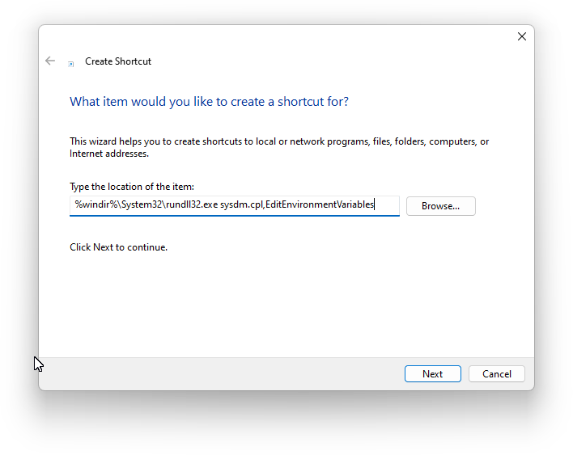
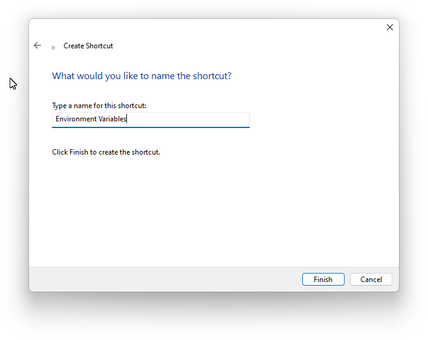

# Windows

## Environment Variables

### Access through a shortcut

1. Right-click blank area of your computer desktop and select `New -> Shortcut`
2. In the `Create Shortcut` window type

    `#!batch %windir%\System32\rundll32.exe sysdm.cpl,EditEnvironmentVariables`
    

3. Click `Next` and give it a name like `Environment Variables`
    